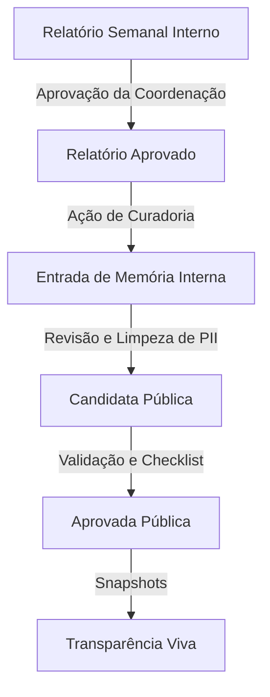

# Governança Editorial e Curadoria da Memória Pública

Este documento descreve as regras e processos para transformar registros internos do projeto SEMEAR Territórios em memória institucional pública para a **Transparência Viva**.

## 1. Princípios Fundamentais

1.  **Privacidade Primeiro**: Nenhum dado pessoal identificável (PII) deve ser publicado.
2.  **Transparência Responsável**: A abertura de dados deve servir ao interesse público sem colocar em risco a equipe ou os participantes.
3.  **Humanidade e Rigor**: A memória curada deve refletir a realidade do campo, incluindo aprendizados e desafios, mas com linguagem adequada ao público externo.

## 2. Fluxo de Vida da Memória

## 3. Regras de Curation

### O que pode virar Memória Pública?
- Marcos do projeto (ex.: primeira banca realizada em um território).
- Aprendizados metodológicos (ex.: "vimos que o horário da tarde funciona melhor para rodas").
- Decisões estratégicas (ex.: "foco expandido para o bairro X devido à demanda Y").
- Síntese de atividades realizadas.
- Problemas estruturais e encaminhamentos (desde que não exponham indivíduos).

### O que NUNCA deve ser público?
- **Dados Pessoais**: CPF, RG, Telefone, Endereço de participantes ou equipe.
- **Dados de Saúde**: Diagnósticos ou relatos médicos individuais.
- **Conflitos Internos**: Questões disciplinares ou de gestão de pessoas.
- **Anexos Brutos**: Fotos ou documentos sem autorização expressa ou que contenham dados sensíveis.

## 4. Checklist de Privacidade (Obrigatório)

Toda entrada marcada como `public_candidate` ou `public_approved` deve passar pelo seguinte checklist:

1.  [ ] **Sem CPF**: Validado pelo detector e revisão manual.
2.  [ ] **Sem Telefone**: Validado pelo detector e revisão manual.
3.  [ ] **Sem Endereço**: Removidas referências a ruas e números específicos.
4.  [ ] **Sem Nomes Brutos**: Substituir nomes de entrevistados por termos genéricos (ex: "uma moradora", "um jovem").
5.  [ ] **Sem Dados de Saúde**: Garantir que relatos sobre saúde sejam agregados e anônimos.
6.  [ ] **Linguagem Adequada**: Texto revisado para tom institucional e respeitoso.

## 5. Responsabilidades

-   **Equipe**: Identifica trechos relevantes nos relatórios semanais e sugere a criação de entradas de memória interna.
-   **Coordenação**: Realiza a curadoria ativa, remove PII, preenche o checklist e marca como `public_candidate`.
-   **Admin**: Realiza a validação final e aprova para `public_approved`.

## 6. Uso na Transparência Viva

Apenas entradas com status `public_approved` são consideradas nos snapshots de transparência. O sistema de snapshots deve contar e listar apenas os títulos e datas dessas memórias, mantendo o corpo acessível apenas sob demanda ou em relatórios específicos, conforme a configuração de privacidade.
